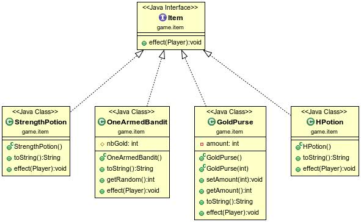
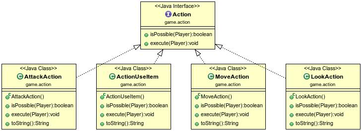
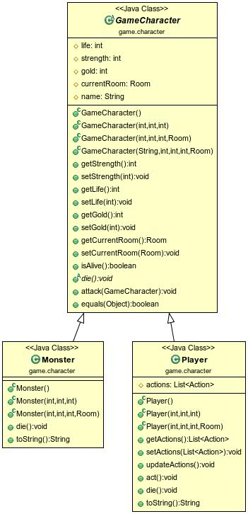
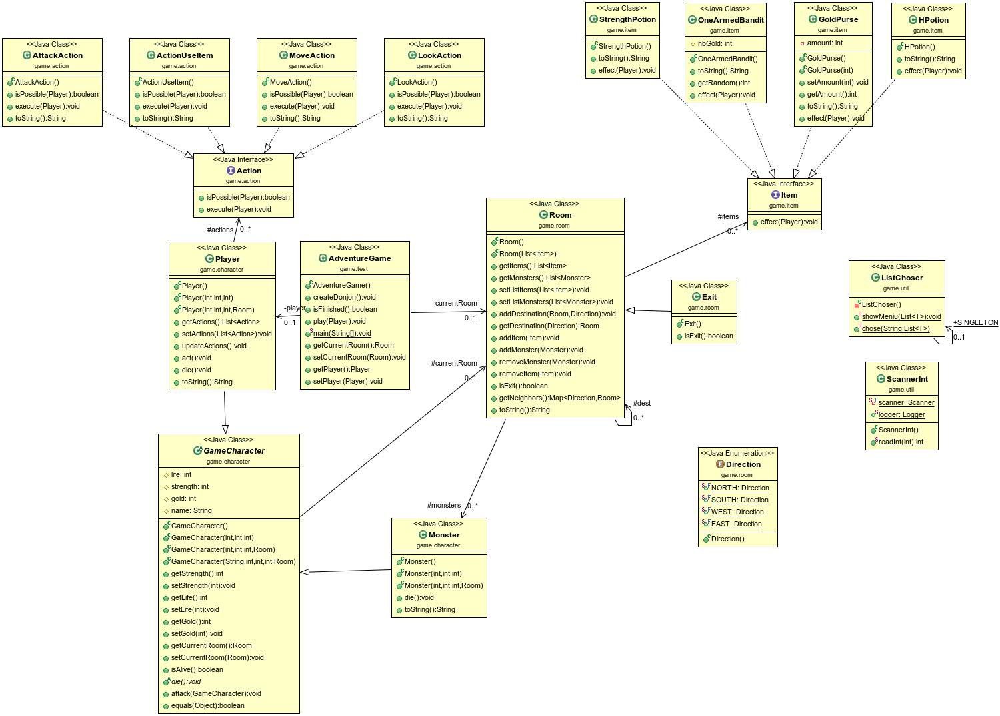

Simona Enasoae
Marcel Fernandez de la Pena

1. Introduction

Le projet Donjon est un jeu d'aventure. Le but du jeu est d'arriver à une des sorties dans le Donjon en parcourant les differentes chambres. Pendant le jeu le joueur va trouver des monstres qui devra tuer ansi que des objects qui lui apporterent plus de points.

2. Howto

  - git pull
  - mvn javadoc:javadoc (target/doc)
  - mvn package
  - java -jar target/DONJON-GIT-0-SNAPSHOT.jar

3. Elements de code

    - Le projet contien des interfaces.
    - Une interface Item pour répresenter differents types d'items
    

    - Une interface pour répresenter les actions.
    Pour les sous-classes d'Action nous avons implementé la méthode abstraite execute qui permet de faire un choix dans une liste des objets puis appliquer son effet. Nous avons tester cette méthode en faisant une rédirection du system out et system in.
    

    - Une classe abstraite GameCharacter pour differencier le player et les monstres
    

    - Nous avons utilisé le pattern SINGLETON pour la classe listChooser parce qu'il y a besoin d'une seule instence de la classe.

4. Voici le diagrame Générale

    

#Consignes pour le jeu
    - Le jeu commence directement dans la chambre principale du Donjon. On affiche le menu avec les actions possibles. Pour avoir un Donjon simple sous le principe KISS(Keep It Simple Stupid), les monstres ont les mêmes caractéristiques.
    -La classe principale se trouve dans le paquet game.test et s'appelle AdventureGame