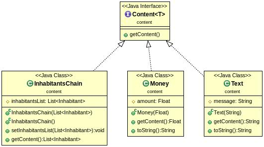
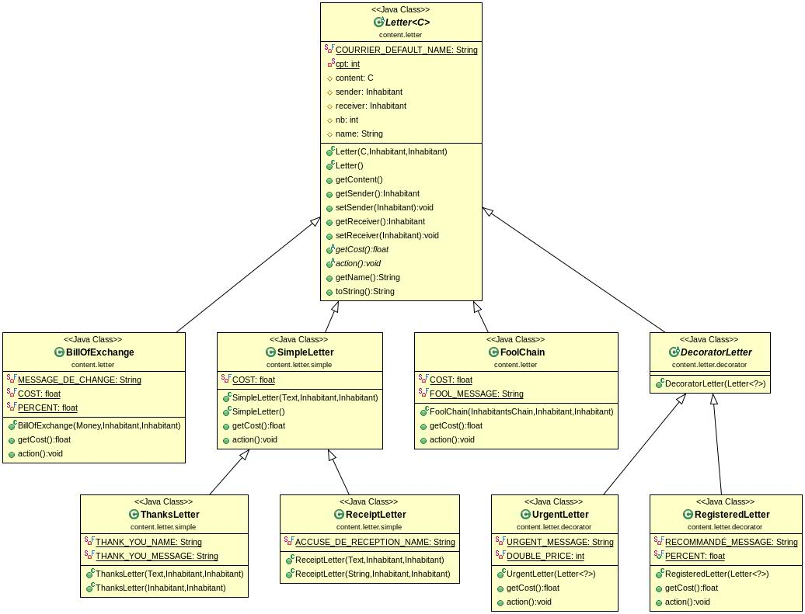
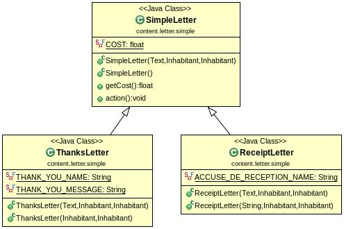
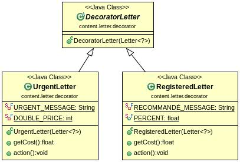
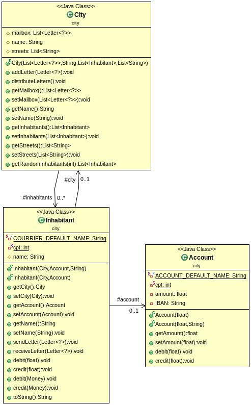
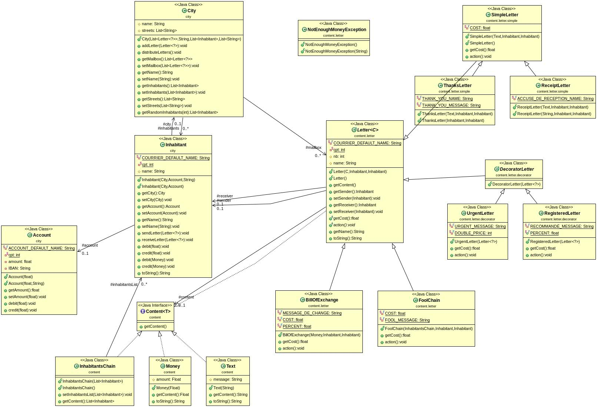

Simona Enasoae
Marcel Fernandez de la Pena

## Introduction

Le projet courriers est une simulation qui peremet d'envoyer des differents types des courriers aux habitants dans des villes differentes; parmis les types des courriers on trouve des lettres simples contenant du text, des lettres de change avec une certaine quantité d'argent. Ces lettres peuvent être envoyées urgentement et elles peuvent être envoyées en recommandé. Il existe aussi une simulation des chaînes des naïfs.

##Howto

  - git pull
  - mvn javadoc:javadoc
  - mvn package
  - java - jar target/COURRIERS-1.0-SNAPSHOT.jar

##Elements du code

  - Nous avons utilisé une interface pour les types des contenus dans les lettres.

    

  - Une classe abstaite pour gerer toutes les lettres

    

  - Pour répresenter les objets du type ThanksLetter et ReceiptLetter qui ont comme fonctionne envoyer un message de texte, nous avons régroupé ces deux classes sous une classe simpleLetter.  

    

  - On a utilisé le decorator design pattern pour les lettres urgentes et recommandés, parce que leur contenu est une lettre.

    

  - Une ville conient des habitants et ces dernières possedent un compte.

    

  - Voici le diagrame général

    
