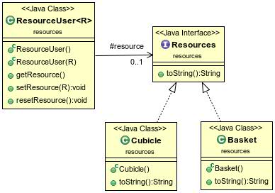
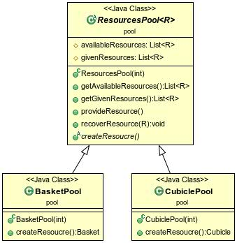
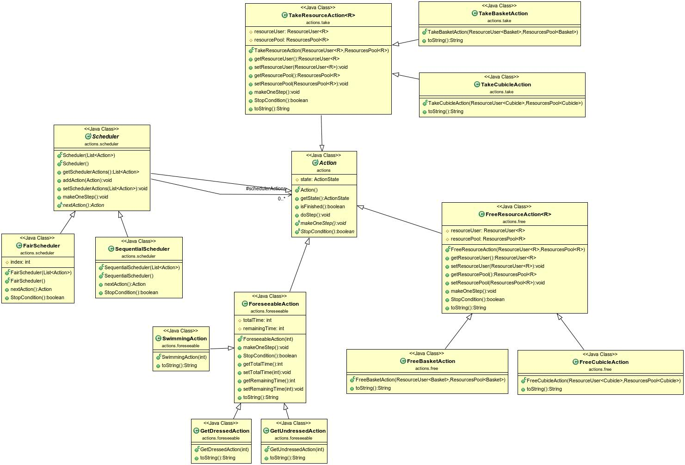
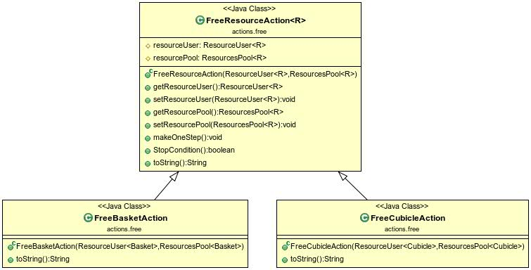
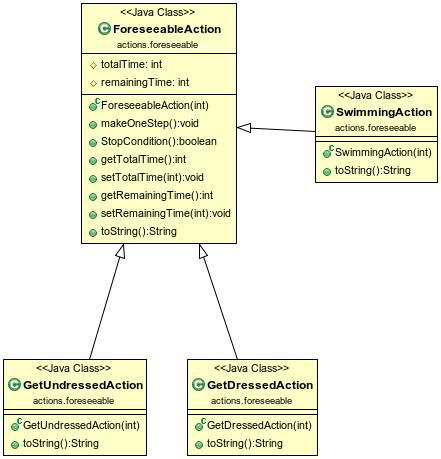
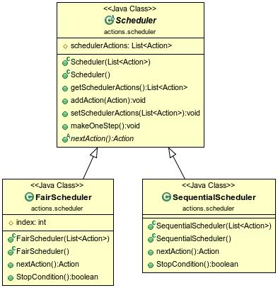
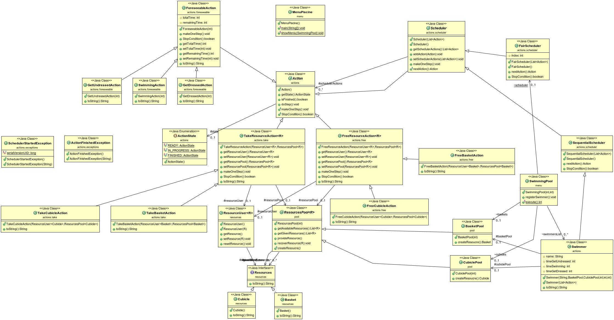

Simona Enasoae
Marcel Fernandez de la Pena

## Introduction

Le projet de la Piscine est une simulation d'un gestionnaire de resources dans lequel les utilisateurs doivent réaliser plusieurs actions, prendre des resources à fin de faire cette simulation.

##Howto

  - git pull
  - mvn javadoc:javadoc
  - mvn package
  - java - jar target/PISCINE-1.0-SNAPSHOT.jar

##Elements du code

   - Une interface permet de gérer les ressources qu'on trouve dans la piscine

    

   - La classe abstraite ResourcesPool qui sert à créer les paniers et les cabines disponibles

    

   - On trouve une classe Action avec la méthode abstraite makeOneStep qui permet de copleter un pas de l'action; la méthode stopCondition qui sert à savoir si l'action est déjà terminé

    

   - TakeResourceAction s'adresse à un gestionnaire de ressources communiqué à la construction pour prendre une ressrouce.

    

   - FreeResourceAction permet de liberer une ressource précédentemnt prise.

    

   - ForeseeableActions ces sont des actions qui servent un certain temps, connu à l'avance, pour les réaliser.

    

   - SchedulerActions fait progresser une liste des actions pas-à-pas jusqu'à ce qu'elles soient terminées.

    
   
   - Voici le diagrame générale de la piscine

   

- ## Nous avons utilisé des classes génériques pour mieux répresenter le besoin d'avoir des classes qui font la même chose mais qui gérént des objets differents.   

- ## Il y a un test avec les swimmers de la feuille pour prouver le bon fonctionnement de la piscine.
