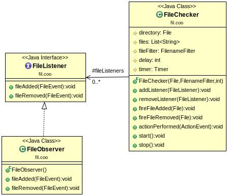
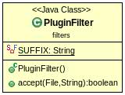
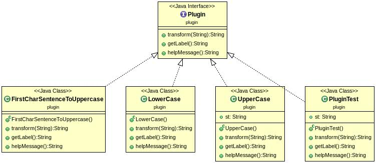
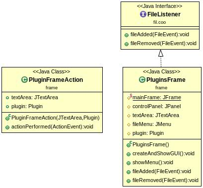
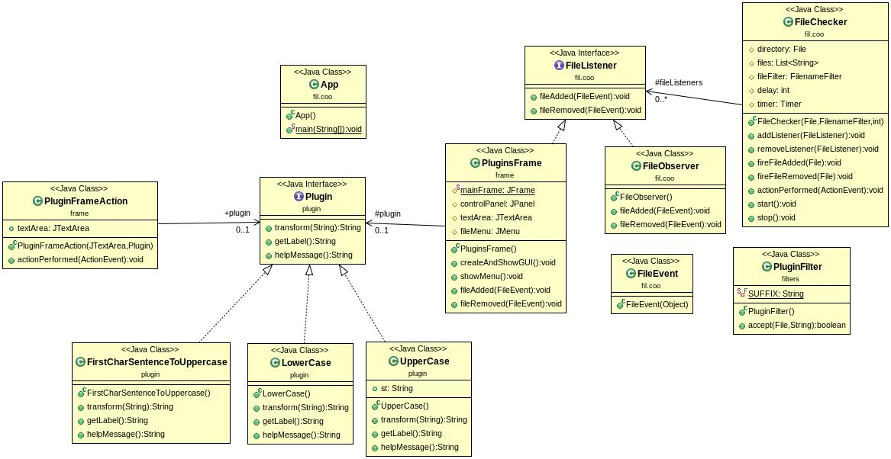

Simona Enasoae,
Marcel Fernandez

## Introduction

Ce project consiste en un programme qui accepte dynamiquement l'ajoute des plugins installés dans un certain repertoire. Pour faire cela nous avons utilisés le design pattern "observer" qui émet des évènements au moment de l'ajoute d'un nouveau fichier dans le répertoir specifique, et au même temps le fichier est soumise aux certains filtres pour pouvoir être accepté.

## Howto
  There are 2 posibilities:
  1.
  - git pull
  - cd Plugins
  - mvn javadoc:javadoc
  - mvn package
  - java - jar target/Plugins-1.0-SNAPSHOT.jar
  - add/remove files in the folder repository which is in the same folder
  2.
  - cd fichierPlugins
  -  java -classpath classes:repository fil.coo.App &
  - add/remove file .class from the repository which is in the folder

## Elements du code

- L'interface FileListener, qui extends EventListener sert à propager un évènement. Dans cette ocasion c'est au moment de l'ajoute ou la suppresion d'un fichier dans le repertoire. C'est l'implementation du design pattern observer. La tâche de la classe FileChecker est de ajouter les listeners et de mantenir les fichiers à jour.

 

 - PluginFilter est la classe qui est en charge de gérer l'acceptation d'un fichier, elle verifie que ce fichier soit un .class, appartien au paquet des pluigns et impléments l'interface plugin.

 

 - On a crée des differentes classes Plugins dont toutes implémentent l'interface Plugin. Elles transforment un String.

  

- L'interface graphique implémente aussi FileListener, ce qui permet d'ajouter un JMenu au moment de la detection d'un nouveau fichier ou de le supprimer. Nous avons crée la classe PluginFrameAction enchargé de faire l'action du Plugin.

  

- Voici le diagrame générale

  
